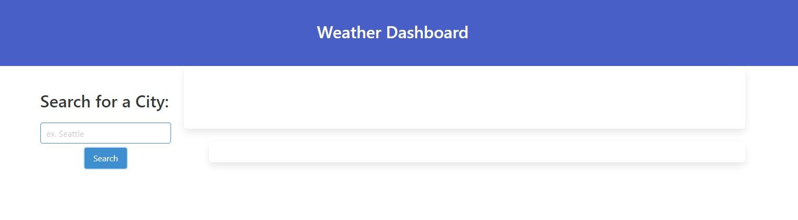
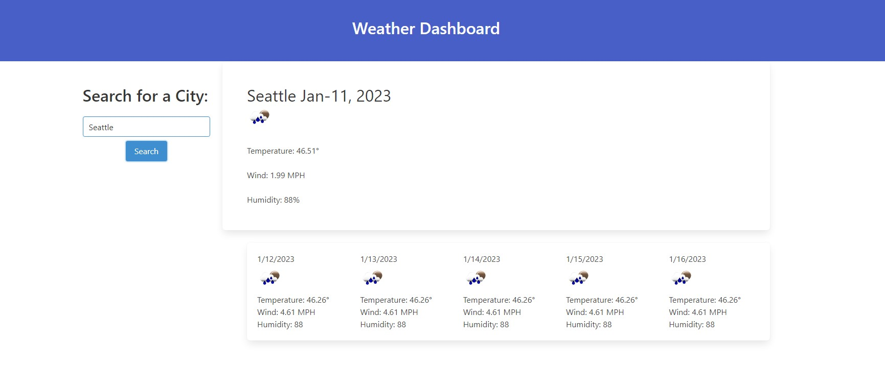

# weather-dashboard

## Description

Provide a short description explaining the what, why, and how of your project. Use the following questions as a guide:

The motivation behind this project was to practice the usage of server-side APIs in a functional manner.
This project was built to utilize server-side APIs to display weather data based on user input. The project utilizes several fetch methods to draw the correct information to display to the user on a main current day display, along with a 5-day forecast. This solved the problem of an individual who was looking for the current day forecast along with the future 5-day forecast.

This project taught me how to utilize server-side APIs - requesting the keys to be able to access the information within them, as well as how to properly look through the data in the console to grab the data that I was looking for. There were some issues in this project that were not able to be addressed - I was having a difficult time creating the functions to create buttons on the user interaction of a search that would be able to display a previously searched city, based on saved local data. If the button were to have been present, the user would have been able to select on the previously searched city, and that city's weather forcast and current day weather would be displayed.

## Installation

Begin at the GitHub repository that holds the code:
https://github.com/jhnwoo-dev/daily-planner

Once you are at the correct repo, click on the green "<> Code" button and select "SSH" under the "Local" tab.

Copy the SSH key to your clipboard and navigate to your terminal.

Once you are in your terminal, navigate to the directory of which you would like to clone this repository.

When you are at the destination you would like to clone, follow through with the git cloning procedures as you would normally.

For Windows: git clone "key that was copied to your clipboard" --> Enter

## Usage

Upon loading up the page, you will be greeted with an empty search bar.

Fill in the search bar with a valid city, and a current day weather report along with a 5-day weather forecast will display.
There is a handful of data regarding the forecast that will be displayed to the user.

## Credits

Anthony Martindale -- University of Washington Bootcamp Student
Benjamin Laubach -- University of Washington Bootcamp Student
Emma Waltho -- University of Washington Bootcamp Student
